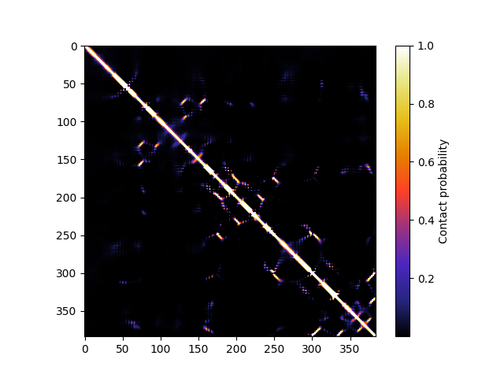
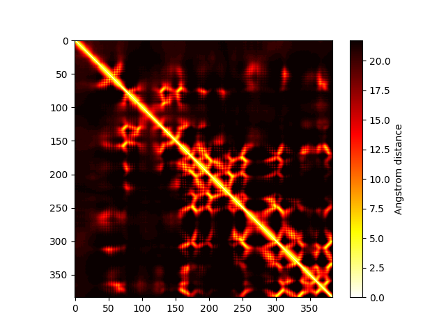

# EMBER2_human
[EMBER2](https:/github.com/kWeissenow/EMBER2) inter-residue distance predictions for the human proteome (< 3000 residues)

# Included files

### Contact maps (8Å threshold)
Example:

### Distance maps
Obtained from raw distance probability distributions by taking mean or mode.

Example:

### Distograms / raw probability distributions
Distance probability distributions over 42 bins, with
- bin #0 representing distances of 0-2Å
- bins #1 to #40 covering distance intervals of 0.5Å each between 2Å and 22Å
- bin #41 representing distances >22Å

# Cite

      Weissenow, K., Heinzinger, M., Rost, B.
	  Protein language model embeddings for fast, accurate, alignment-free protein structure prediction
      bioRxiv 2021.07.31.454572; doi: https://doi.org/10.1101/2021.07.31.454572
